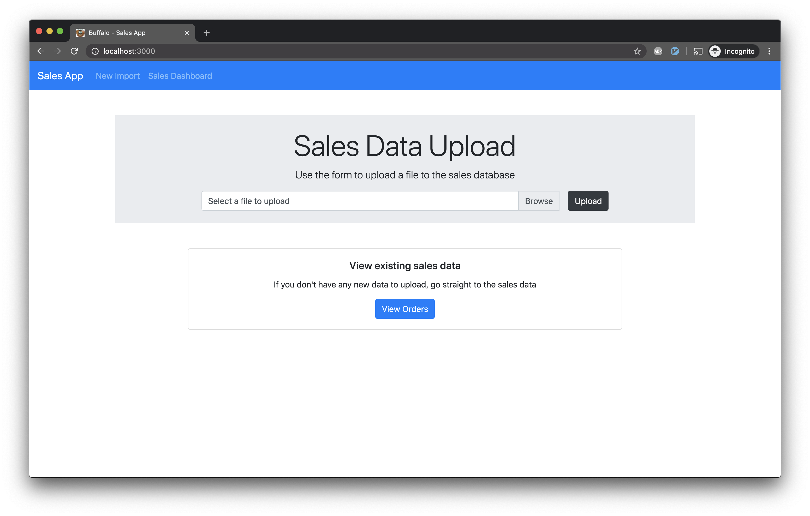
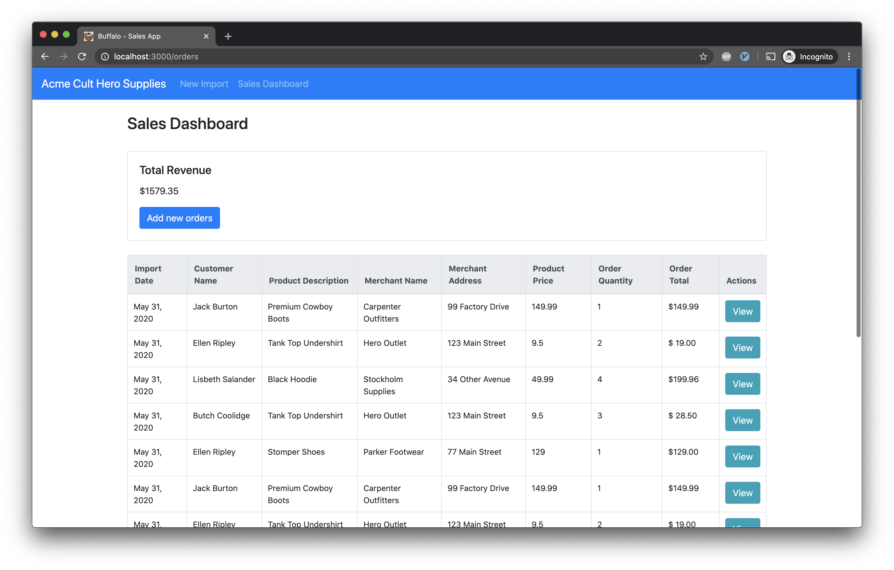

# Sales Admin

## Table Of Contents
- [Requirements](#requirements)
- [To Run](#to-run)
- [Screenshots](#screenshots)
- [Stack](#stack)
    - [Backend](#backend)
    - [Frontend](#frontend)
    - [DB](#db)
- [Endpoints](#endpoints)
- [Scale Considerations](#scale-considerations)
- [Other Considerations](#other-considerations-and-improvements)

## Screenshots




## Requirements
- docker ^17.05
- docker-compose
- dockerd (ensure the docker daemon is running on your machine)
- open ports on 3000 and 5432

## To Run
```bash
cd sales_app
docker-compose up -d
```
Once running, visit localhost:3000 on your browser. (I reccommend incognito to
avoid any cache issues)

## Stack
- API: endpoints and templates built using GoBuffalo
- DB: PostgreSQL

#### Backend
Uses the buffalo app as to route requests, with a pop.Connection middleware
used to access the db. I chose buffalo for this challenge because it allows you
to generate much of the repetitive boilerplate code in a basic API

#### Frontend
I used Bootsrap 4 to style components in the two routes visible on the app's UI. Plush templating was used to create the html

## DB
- PostgreSQL used as persistent storage
- I used Pop to manage the database schema and migrations
- Collections:
    - Merchants
    - Products
        - products belong to one merchant
    - Customers
    - Orders
        - orders have one merchant, customer, and product

## Endpoints
| Service         | Endpoint | Method | Description                                  |
|-----------------|----------|--------|----------------------------------------------|
| Upload          | /upload  | POST   | Returns a 200 for successful import to db    |
| Sales Dashboard | /orders  | GET    | Returns a list of all orders in the database |


## Scale Considerations
- Total revenue calculation is a heavy burden on the database because it is
  being calculated on the server using all rows in the orders table. A sql
  query would be cleaner and faster
- If this application would scale across geographic regions, adding additional
  db nodes and having some sort of data replication among all database nodes
  would improve query time and spread queries across nodes
- As number of records increases, indexing the database would improve query
  times

## Other Considerations and Improvements
- Implement Unit testing
- Stronger data validation for imports
- Better UX on the upload button. Currently it returns an unhandled error if
  the button is pressed before selecting a file. The button should be inactive
  until that point, and flash messages should be used if unsupported filetypes
  are uploaded to the app
- Auth, with roles enabling object editing and deletion 
- Cache middleware in the app to reduce db queries and improve response times
